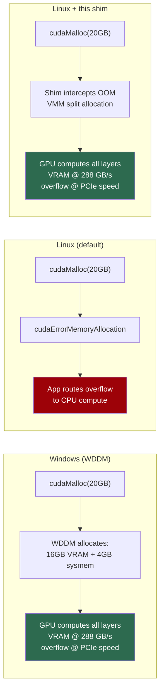
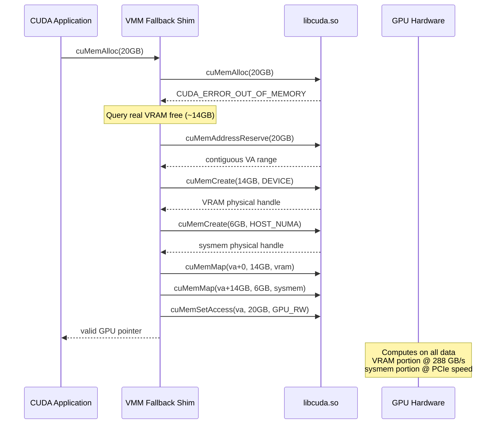
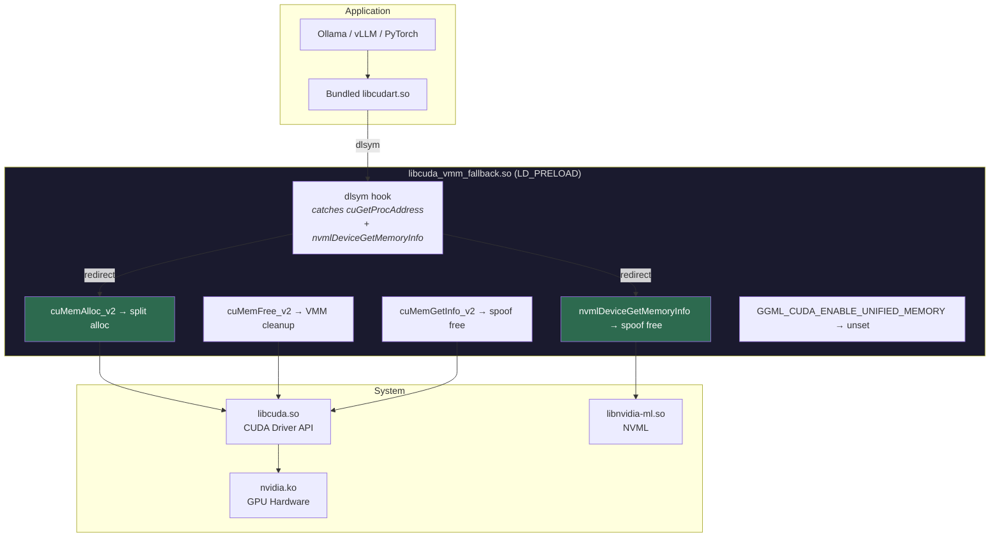
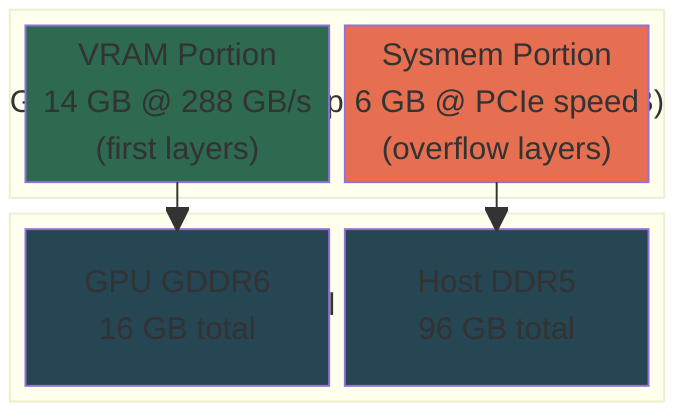
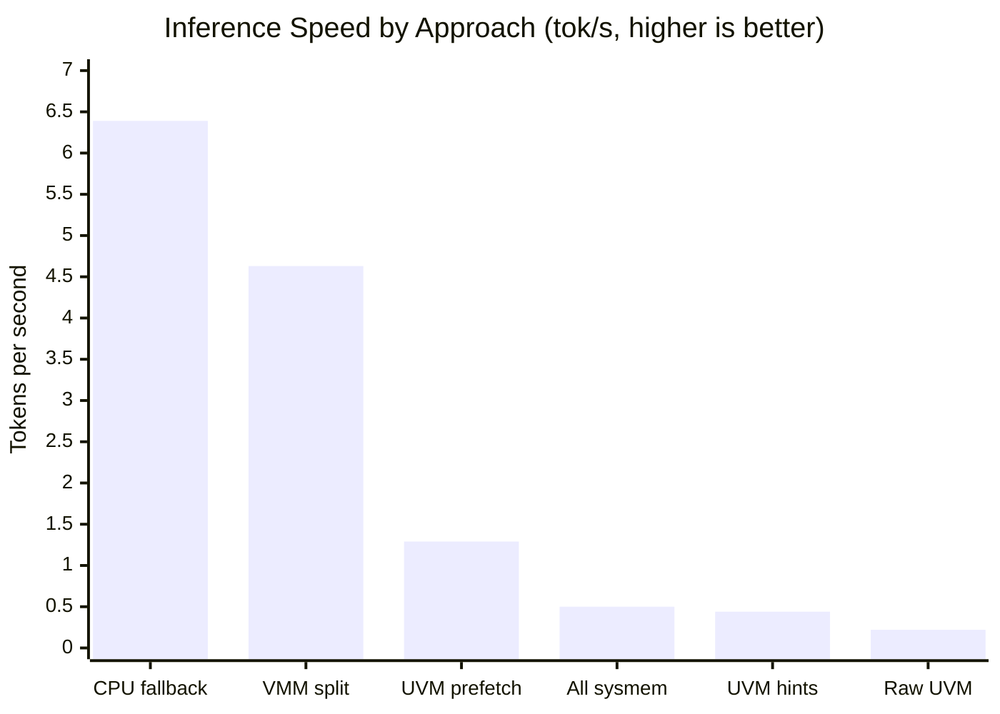
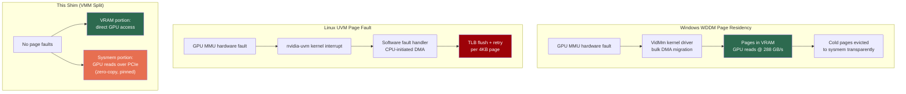

# cuda-vmm-sysmem-fallback

A transparent `LD_PRELOAD` shim that gives Linux the same GPU memory oversubscription behavior as Windows WDDM. When a CUDA application exhausts VRAM, the shim intercepts the allocation at the Driver API level and creates a **split allocation** — first portion in VRAM, overflow in system RAM — behind a single contiguous GPU virtual address. No application changes required.

## The Problem



On Windows, NVIDIA's WDDM driver transparently backs overflowing allocations with system RAM. On Linux, `cudaMalloc()` fails and applications fall back to CPU compute. NVIDIA has an [open feature request](https://github.com/NVIDIA/open-gpu-kernel-modules/issues/663) for Linux sysmem fallback — closed without action.

This project bridges that gap at the userspace level.

## How It Works



The shim also intercepts:
- **NVML** (`nvmlDeviceGetMemoryInfo`) — spoofs inflated VRAM so Ollama's layer planner assigns all layers to GPU
- **`cuMemGetInfo`** — reports VRAM + sysmem capacity
- **`cuGetProcAddress`** / **`dlsym`** — intercepts bundled cudart that bypasses LD_PRELOAD symbol search order
- **`GGML_CUDA_ENABLE_UNIFIED_MEMORY`** — automatically unset (forces `cudaMalloc` path for interception)

## Interception Architecture



## Memory Layout (Split Allocation)



## Benchmark Results

Tested on RTX 4060 Ti 16GB (PCIe x8 Gen4), 96GB DDR5-5200, qwen3:32b Q4_K_M (~20GB model).

| Approach | tok/s | vs Baseline | Mechanism |
|----------|------:|:-----------:|-----------|
| Baseline (GGML CPU fallback) | **6.39** | — | CPU computes overflow @ DDR5 83 GB/s |
| **VMM split (13.1GB VRAM + 5.3GB sysmem)** | **4.63** | 0.72x | GPU reads overflow @ PCIe ~10 GB/s |
| UVM + cudaMemPrefetchAsync | 1.29 | 0.20x | Page migration overhead |
| All-sysmem VMM | 0.50 | 0.08x | All weights over PCIe |
| UVM + cudaMemAdvise hints | 0.44 | 0.07x | Zero-copy but UVM overhead |
| Raw UVM (no hints) | 0.22 | 0.03x | Page fault stalls |



**Key findings:**
- VMM split is **10x faster** than raw UVM and **2x faster** than all other GPU-compute overflow approaches
- CPU fallback still wins by 1.4x on PCIe x8 because DDR5 (83 GB/s) is 5x faster than PCIe x8 Gen4 (15.75 GB/s) for overflow reads
- On PCIe x16 Gen4/Gen5 the bandwidth gap narrows and the shim should match or exceed CPU fallback
- WDDM achieves better results via hardware-level page residency in the GPU MMU — Linux UVM's software fault handling is orders of magnitude slower

## Why WDDM Is Faster



WDDM's advantage is **dynamic page residency** managed at the hardware level. Pages migrate between VRAM and sysmem based on access patterns, with the working set (current layer weights) always in VRAM. Linux has no equivalent kernel-level mechanism — the NVIDIA Linux driver explicitly declined to implement this ([issue #663](https://github.com/NVIDIA/open-gpu-kernel-modules/issues/663), closed Sept 2024).

This shim does the next best thing: a **static split** where the first N bytes live in VRAM permanently and the overflow lives in pinned system RAM with direct GPU page table access. No page faults, no migration overhead.

## Usage

```bash
# Basic: run any CUDA app with the shim
LD_PRELOAD=./libcuda_vmm_fallback.so ollama serve

# Systemd service override
# /etc/systemd/system/ollama.service.d/override.conf:
# [Service]
# Environment="LD_PRELOAD=/usr/local/lib/libcuda_vmm_fallback.so"

# Environment variables:
#   CUDA_VMM_FALLBACK_LOG_LEVEL    0=silent 1=fallbacks 2=all (default: 1)
#   CUDA_VMM_FALLBACK_MAX_SYSMEM   Max sysmem bytes (default: 50% RAM)
#   CUDA_VMM_FALLBACK_DISABLE      Set to 1 to passthrough all calls
```

**Important:** The shim automatically unsets `GGML_CUDA_ENABLE_UNIFIED_MEMORY` because GGML's `cudaMallocManaged` path bypasses the shim's `cuMemAlloc` interception.

## Requirements

- NVIDIA GPU with compute capability 7.0+ (Volta or newer)
- NVIDIA Linux driver 535+ (open or proprietary kernel modules)
- CUDA toolkit 12.0+ (for VMM API support)
- Linux kernel 5.6+

## Building

```bash
make                  # builds libcuda_vmm_fallback.so
make test             # builds test suite (requires nvcc)
sudo make install     # installs to /usr/local/lib/
```

## Testing

```bash
# Full test suite: VRAM fill + sysmem overflow + GPU kernel verification
CUDA_VMM_FALLBACK_LOG_LEVEL=2 LD_PRELOAD=./libcuda_vmm_fallback.so ./tests/test_alloc

# NVML spoofing verification
LD_PRELOAD=./libcuda_vmm_fallback.so nvidia-smi --query-gpu=memory.free,memory.total --format=csv
```

## Prior Art

- [Nixie](https://arxiv.org/abs/2601.11743) — LD_PRELOAD shim for GPU memory virtualization (RTX 5090, no public source)
- [NVIDIA CUDA VMM API](https://docs.nvidia.com/cuda/cuda-driver-api/group__CUDA__VA.html) — underlying API
- [WDDM 2.0 GPU Virtual Memory](https://learn.microsoft.com/en-us/windows-hardware/drivers/display/gpu-virtual-memory-in-wddm-2-0) — Windows mechanism this replicates
- NVIDIA open-gpu-kernel-modules [#663](https://github.com/NVIDIA/open-gpu-kernel-modules/issues/663) — closed feature request

## Status

**Working prototype.** Split VMM allocation verified with Ollama + qwen3:32b (4.63 tok/s). NVML spoofing verified. Test suite passes. Performance limited by PCIe bandwidth for overflow portion — PCIe x16 or Gen5 would close the gap with CPU fallback.

## License

MIT
